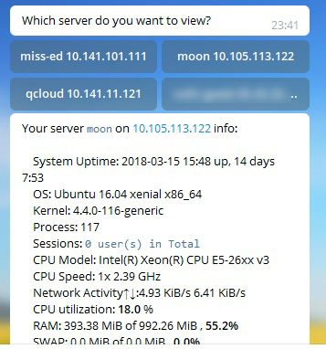
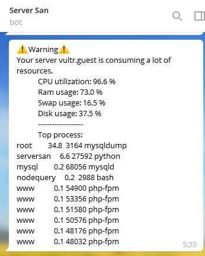
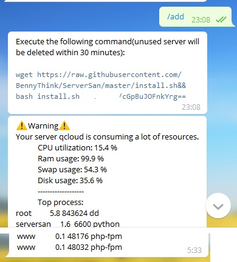

# ServerSan
This project is still under development. However, you may want to [try it out](https://t.me/serversan_bot)!


## Description ##
A telegram bot client/server to monitor Linux/Windows server status.
The reference is [nodequery](https://nodequery.com).


## Tutorial ##
ServerSan is now under testing. You could just click [this link](https://t.me/serversan_bot) to join her!
Any feedback would be deeply appreciated!

## Screenshot ##







## About stability ##
This program is still under development and improvement, so before using it, I would like to make a disclaimer:
* Your data could be deleted without your consent.
* You may receive bot's message which was sent by mistake.
* Your server information(IP, CPU, Mem and so on) maybe reviewed by me if I need the database to run debugs.
* Any changes may not be informed.
In conclusion, a)Welcome to test her; b)No promises for now, though.

## Help needed ##
For now the program has some deadlock issues which result in large consumption of RAM.
gdb shows the following result:
```
Using host libthread_db library "/lib/x86_64-linux-gnu/libthread_db.so.1".
0x00007f68b443c5d3 in select () from /lib/x86_64-linux-gnu/libc.so.6
(gdb) info threads
  Id   Target Id         Frame
* 1    Thread 0x7f68b4b3c700 (LWP 16905) "python" 0x00007f68b443c5d3 in select () from /lib/x86_64-linux-gnu/libc.so.6
  2    Thread 0x7f68b0b8e700 (LWP 16946) "python" 0x00007f68b443c5d3 in select () from /lib/x86_64-linux-gnu/libc.so.6
  3    Thread 0x7f68abfff700 (LWP 16947) "python" 0x00007f68b443c5d3 in select () from /lib/x86_64-linux-gnu/libc.so.6
  4    Thread 0x7f68ab7fe700 (LWP 16948) "python" 0x00007f68b443c5d3 in select () from /lib/x86_64-linux-gnu/libc.so.6
  5    Thread 0x7f68aaffd700 (LWP 16949) "python" 0x00007f68b443c5d3 in select () from /lib/x86_64-linux-gnu/libc.so.6
  6    Thread 0x7f68aa7fc700 (LWP 16951) "python" 0x00007f68b443c5d3 in select () from /lib/x86_64-linux-gnu/libc.so.6
  7    Thread 0x7f68a9ffb700 (LWP 16952) "python" 0x00007f68b443a74d in poll () from /lib/x86_64-linux-gnu/libc.so.6
  8    Thread 0x7f68a95df700 (LWP 18973) "python" 0x00007f68b4718827 in do_futex_wait.constprop () from /lib/x86_64-linux-gnu/libpthread.so.0
  9    Thread 0x7f68a8a1e700 (LWP 20787) "python" 0x00007f68b4718827 in do_futex_wait.constprop () from /lib/x86_64-linux-gnu/libpthread.so.0
  10   Thread 0x7f689373f700 (LWP 23323) "python" 0x00007f68b4718827 in do_futex_wait.constprop () from /lib/x86_64-linux-gnu/libpthread.so.0
  11   Thread 0x7f6892f3e700 (LWP 23324) "python" 0x00007f68b4718827 in do_futex_wait.constprop () from /lib/x86_64-linux-gnu/libpthread.so.0
(gdb)
```
into thread 10:
```
#28 0x00000000004eebee in PyObject_Call (kw=0x0,
    arg=(<Thread(_Thread__ident=140087127176960, _Thread__block=<_Condition(_Verbose__verbose=False, _Condition__lock=<thread.lock at remote 0x7f68a8ae82f0>, acquire=<built-in method acquire of thread.lock object at remote 0x7f68a8ae82f0>, _Condition__waiters=[], release=<built-in method release of thread.lock object at remote 0x7f68a8ae82f0>) at remote 0x7f68b0344650>, _Thread__name='ThreadPoolExecutor-0_2', _Thread__daemonic=True, _Thread__started=<_Event(_Verbose__verbose=False, _Event__flag=True, _Event__cond=<_Condition(_Verbose__verbose=False, _Condition__lock=<thread.lock at remote 0x7f68a8ae8190>, acquire=<built-in method acquire of thread.lock object at remote 0x7f68a8ae8190>, _Condition__waiters=[], release=<built-in met---Type <return> to continue, or q <return> to quit---
hod release of thread.lock object at remote 0x7f68a8ae8190>) at remote 0x7f68b0344550>) at remote 0x7f68b0344b50>, _Thread__stderr=<file at remote 0x7f68b4b1d1e0>, _Thread__target=<function at remote 0x7f68b0e0e848>, _Thread__kwargs={}, _Verbose__verbose=False, _Thread__args=(<weakref at rem...(truncated), func=<function at remote 0x7f68b1fe5aa0>) at ../Objects/abstract.c:2546
#29 instancemethod_call.lto_priv () at ../Objects/classobject.c:2602

```
I may need more investigation.

## Setup your own bot ##
Please reference [DEPLOY.MD](DEPLOY.MD).


## Development status ##
- [x] client side script is almost done. Except for upgrade utility.
- [x] Server side program
- [x] SSL support 
- [x] Delete unused server block within 30 minutes.
- [x] Warning when resource exceeds
- [x] Personal settings: notifications.
- [x] Auto clean old records: every 180 days, not enable for now 
- [ ] **Large memeory consumption issue!**: this has been identified as a deadlock issue.
- [ ] Generate plot about mem, CPU, Disk...
- [ ] TravisCI
- [ ] Windows client scripts maybe?
- [ ] Use Telegram's setWebhook? Whenever there is an update for the bot, we will send an HTTPS POST request to the specified url, containing a JSON-serialized Update. 


## For Developers and Contributors: Design Pattern ##
This program should support any platform that has a officially supported Python2/3.
This program could be split into four parts:

### 1. Client side ###
1. It's a tiny python script running periodically with cron and gathering system information.
After that, it's going to send POST request to the server.
2. The installation should be done by a shell script with an auth code generated when talking with serversan_bot.
3. Refer to nodequery, the auth code should be saved in `/etc/serversan/auth.log`

### 2. Server side: webhook ###
This webhook, is designed to receive and parse POST request from client side. 
In order to prevent from DDoS attack, replay attack or any other kind of attack, we should verify the request. 
After the validation of one single request, the webhook will parse and insert the information into database.

### 3. Server side: database ###
Currently we preferred to use MongoDB instead of MySQL. The database, serversan, for now contains three collections(tables):
1. user info table, the columns are: userID, username, nickname, role_id
2. system info table: cpu, mem, disk.....Key, token
3. role table: role_id, name, permission.

Be advised that every valid request will be stored in database for future demos(charts, etc.).

### 4. Server side: telebot ###
This part should handle interaction with telegram bot. Its command should contain at least the following functions:
stat, add, delete, start, help, reinstall, threshold settings(for heavy resource consumption)
The command may be extended in the future.

### Conclusion ###
The server needs two program: webhook and telebot.


## Packages ##
Flask for webhook, pyTelegramBotAPI for telegram bot wrapper, APScheduler for cron job inside telebot.
And MongoDB for database.


## Contribution ##
Any issues, PRs are welcomed! However, collaborators should obey some requirements:
1. Commits should be atomic, one commit should only resolve one issue. Thus please rebase your commits when necessary.
2. Use English in comments and readme. Follow PEP8.
3. Use tab, indent size of 4 spaces. By the way, shell scripts should be ended with LF.
4. Test before push.
5. Repository structure should follow common structures: 
test dir for unit test, serversan for main program, shell script and auxiliaries should be placed in root.
6. Security of the server side is extremely important and should be able to protect against normal attacks.


## FAQ ##
### Why don't you choose to use `nq-agent.sh` ###
Because shell scripts are limited to UNIX-like system while I want to add support for non-UNIX system if possible.


## License ##
Apache License 2.0